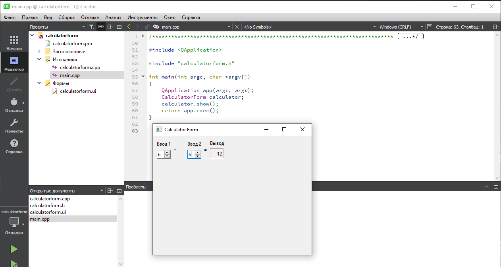
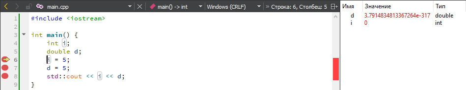
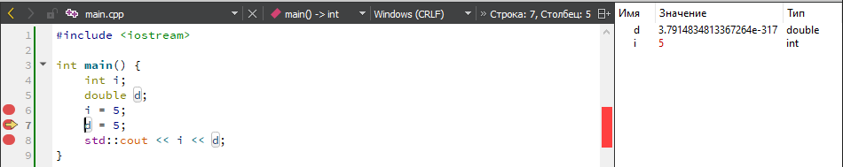
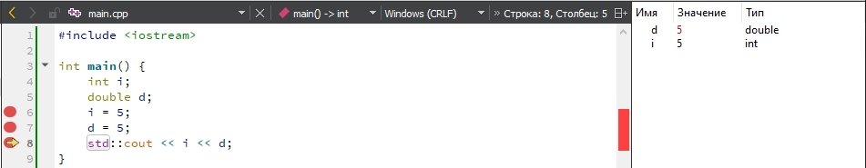

<p align="center">МИНИСТЕРСТВО НАУКИ  И ВЫСШЕГО ОБРАЗОВАНИЯ РОССИЙСКОЙ ФЕДЕРАЦИИ<br>
Федеральное государственное автономное образовательное учреждение высшего образования<br>
"КРЫМСКИЙ ФЕДЕРАЛЬНЫЙ УНИВЕРСИТЕТ им. В. И. ВЕРНАДСКОГО"<br>
ФИЗИКО-ТЕХНИЧЕСКИЙ ИНСТИТУТ<br>
Кафедра компьютерной инженерии и моделирования</p>
<br>

<h3 align="center">Отчёт по лабораторной работе № 4<br> по дисциплине "Программирование"</h3>

<br><br>

<p>студента 1 курса группы ИВТ-б-о-202(2)<br>
Койдана Даниила Сергеевича<br>
направления подготовки 09.03.01 "Информатика и вычислительная техника"</p>

<br><br>

<table>
<tr><td>Научный руководитель<br> старший преподаватель кафедры<br> компьютерной инженерии и моделирования</td>
<td>(оценка)</td>
<td>Чабанов В.В.</td>
</tr>
</table>
<br><br>

<p align="center">Симферополь, 2021</p>
<hr>

## Цель:


1. Установить фреймворк Qt;
2. Изучить основные возможности создания и отладки программ в IDE Qt Creator.

## Постановка задачи
Настроить рабочее окружение, для разработки программного обеспечения при помощи Qt и IDE Qt Creator, а также изучить базовые возможности данного фреймворка.

## Выполнение работы

### Задание 1

Скачал с официального сайта последнюю версию Qt Creator, установил основные компоненты MinGW последней версии. В разделе примеры нашел проект Calculator Form Example, запустил его, на боковой панели в разделе Проекты в каталоге Формы открыл главную форму проекта и заменил текст "Input 1", "Input 2", "Output" на "Ввод 1", "Ввод 2" и "Вывод" соответственно. (рис.1)



Рисунок 1. Проверка работоспособности.

### Задание 2

1. Как изменить цветовую схему (оформление) среды?**<br>
- Инструменты -> Параметры -> Среда -> Тема.
2. Как закомментировать/раскомментировать блок кода средствами Qt Creator? Имеется в виду комбинация клавиш или пункт меню.**<br>
- Ctrl + /
3. Как открыть в проводнике Windows папку с проектом средствами Qt Creator?**<br>
- Пкм по папке -> Показать в проводнике.
4. Какое расширение файла-проекта используется Qt Creator? Может быть несколько ответов.**<br>
- .pro
5. Как запустить код без отладки?**<br>
- Ctrl + R
6. Как запустить код в режиме отладки?**<br>
- F5
7. Как установить/убрать точку останова (breakpoint)?**<br>
- Как в Microsoft Visual Studio (левее от номера строки).

### Задание 3

Создал консольное приложение без Qt и заменил содержание файла main.cpp.

```c++
#include <iostream>

int main() {
    int i;
    double d;
    i = 5;
    d = 5;
    std::cout << i << d;
}
```

После этого поставил breakpoint'ы на шестой, седьмой и восьмой строке и запустил режим отладки.



Рисунок 3. Значение переменных i и d в 6 строке.



Рисунок 4. Значение переменных i и d в 7 строке.



Рисунок 5. Значение переменных i и d в 8 строке.

## Вывод по работе. 

Цель работы была успешно достигнута. Было выполнено:
- Установка Qt Creator, ознакомление с интерфейсом программы, смена интерфейса среды.
- Создание каталога и запуск первой программы.
- Редактирование кода в среде разработке Qt.
- Ознакомление с примерами встроенных в среду проектов.
